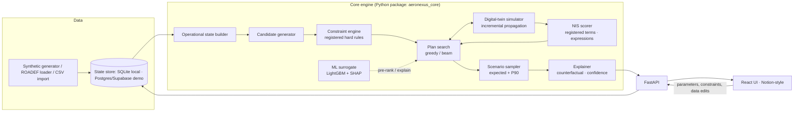

# AeroNexus — Implementation Plan (Foundation Document)

**AI-Based Cancellation Prioritization for Flight Disruptions**
IndiGo × UPES AI Challenge · Problem Statement 01
Team: Prachi Agarwalla, Aniruddh Vijayvargia
Version 0.5 · September 2026 · Status: **Phases 0–7 complete (2026-09-11) — student track built; faculty track (§23) next**

---

## 0. How to use this document

This is the single source of truth for the AeroNexus build. Every design decision, constraint, score term, page, endpoint and milestone lives here. When something changes, this file changes first.

Reading order for a newcomer: §1 principles → §5 architecture → §7 simulator → §8 constraints → §10 score → §22 execution plan.

Track strategy: **build the Student Track end-to-end first (§22), then extend the same codebase to the Faculty Track (§23).** Nothing built for the student track is thrown away.

---

## 1. Vision and non-negotiable principles

**Vision.** When a disruption puts many flights at risk, AeroNexus shows the OCC controller the three best plans, what each one does to the rest of the day, and why — in seconds, with every recommendation reproducible after the fact.

**Non-negotiables** (these override convenience):

| # | Principle | What it means in code |
|---|---|---|
| P1 | The decision engine is deterministic and auditable | Same inputs + same config hash → same output. No LLM inside the scoring or search path. |
| P2 | Hard constraints are never traded off | A violating option is removed with a reason, never penalised into the ranking. |
| P3 | Nothing is rigid | Score terms, constraints, thresholds, search settings, data columns are configuration, editable at run time from the UI, versioned per run. |
| P4 | The simulator is the product | Candidates are evaluated by simulating their consequences on a shared operational state, not by static features. |
| P5 | The controller decides | AeroNexus recommends and explains; it never executes. |
| P6 | Free tier, local-first | Everything runs on a laptop; cloud is only for the demo, and only on free tiers. |
| P7 | Plain-language UI | Notion-like operations workspace. No "AI" styling. |

---

## 2. Decision log — conflicts found and how they are resolved

These are settled. Re-open only with a written reason.

| # | Conflict | Resolution |
|---|---|---|
| D1 | Brief asks for a *composite* "network impact score"; proposal §5 uses a *priority order* | Both are **ranking modes** over the same term set (§10.4). Default `composite`. `priority` is a switch. |
| D2 | Dynamic parameters vs strict, auditable constraints | Constraints and terms are registered objects with config (§15). Each run stores `config_hash`; history is immutable. |
| D3 | Seconds latency vs beam × Monte-Carlo × simulation | Two-phase evaluation + incremental propagation (§11.4). Latency budget is a parameter. |
| D4 | Single-leg cancellation strands the aircraft | `CANCEL_CYCLE` action; simulator tracks aircraft location; forced downstream cancellations emerge from the simulation (§9). |
| D5 | "AI-based" vs "no AI-looking UI" | AI in the engine (§13); UI is an ops workspace (§18). |
| D6 | Free tier vs always-on demo | Local-first. Demo: Vercel (UI) + Render free (API) + Supabase free (Postgres, required because Render's free disk resets on spin-down). Pitch day: Cloudflare Tunnel from a laptop for zero cold start. Precomputed runs shipped as JSON fallback (§20). **HF Spaces, Railway and Fly.io are not free in 2026 — verified.** |
| D7 | Student simplicity vs faculty depth | One codebase; faculty adds modules, never rewrites (§23). |
| D8 | High-value / special-needs pax vs no PII | Per-flight category **counts** (§6.3). |
| D9 | Learned policy (faculty) vs deterministic decision (P1) | Learned models **guide/prune** the search or serve as a *benchmark baseline*; they never make the final call (§13, §23). |
| D10 | Synthetic data realism vs free availability | Seeded IndiGo-like generator calibrated on public data + ROADEF 2009 loader for external benchmark (§16). |
| D11 | Stand/gate capacity: proposal said out of scope, brief lists it as input | Implemented as a simple per-airport, per-hour **cap** constraint (§8, H4c). Full gate assignment stays out of scope. |
| D12 | Evaluation circularity (simulator evaluates itself) | Separate *evaluation* simulator config (more scenarios, different seed and delay model) + expert-ranked cases (§17). |

---

## 3. What already exists, and what we take from it

| Source | What it does | What we take |
|---|---|---|
| Lufthansa Systems NetLine/Ops++ aiOCC (commercial, RL-based) | Monitors aircraft / rotation / pax / crew events, flags delay risk ahead of time, shows impact on *resilience, buffer and propagated delay*; decision stays with the controller | Show per-option **buffer consumed**, **propagated delay** and **next-wave robustness**. Risk-ahead candidate generation. Controller-decides stance. |
| Amadeus Schedule/Passenger Recovery, Sabre IROPS | Passenger re-accommodation cost is central | Re-accommodation engine as a first-class score term (§10.2). |
| Lufthansa/Google schedule recovery (Edelman finalist) | Joint aircraft–crew–pax optimisation in production | Faculty-track CP-SAT model (§23.1). |
| ROADEF 2009 (Amadeus) benchmark | Text-file instances: aircraft, flights, rotations, itineraries, airport capacities, config with cost coefficients, disruption files | Adopt a **compatible instance format** so ROADEF instances load natively; default cost coefficients (delay cost per pax-minute by itinerary class, cancellation cost per pax, operating cost per flight hour). |
| Academic reviews (Computers & OR 2024; Engineering 2021) | Taxonomy of recovery methods; cascade modelling | Benchmark ladder design; propagation model. |
| No complete open-source implementation found | — | We build the simulator ourselves; publishing it is a contribution. |

---

## 4. Scope

### 4.1 Student Track MVP (what must exist to submit)

- Synthetic IndiGo-like network + disruption scenarios (seeded, exportable).
- Digital-twin simulator with aircraft, crew and passenger layers.
- Hard-constraint engine (§8) with reasons for exclusion.
- Actions: `CANCEL_LEG`, `CANCEL_CYCLE`, `DELAY`, `SWAP`.
- Network Impact Score with configurable terms and two ranking modes.
- Greedy/beam search producing **top-3 plans with reasons**.
- Light uncertainty: top plans re-evaluated under S sampled scenarios → expected + P90.
- ML surrogate (LightGBM) for pre-ranking + SHAP "what drives this score".
- Notion-style UI + REST API; parameters editable in UI; add-a-column → add-a-parameter.
- 10 hand-crafted validation cases (pytest) + benchmark ladder B0/B1/B2 on 200 generated scenarios.
- Audit log of runs with config hash.

### 4.2 Faculty Track extensions (same codebase)

CP-SAT exact model (B3), correlated clearing-time uncertainty, `WAIT` action (two-stage), ROADEF instances, learned search guidance (LightGBM → GNN), Gymnasium RL environment + PPO baseline (B5), ablations, paper.

### 4.3 Explicitly out of scope (both tracks, v1)

Ferry flights, multi-swap chains, gate *assignment*, cargo, environmental objectives, detailed crew re-pairing optimisation, execution into airline systems, LLM-made decisions.

---

## 5. System architecture



**Request flow for one recommendation** (`POST /recommend`):
1. Load state snapshot at decision time *t* (only information known at *t*).
2. Generate candidate actions for at-risk flights (§9).
3. Filter by hard constraints → keep feasible; record reasons for infeasible.
4. (Optional) Surrogate pre-rank → keep top-M.
5. Beam search: apply → incremental simulate → score → keep top-K partial plans, depth D.
6. Re-evaluate top-N plans under S sampled scenarios → expected NIS, P90.
7. Build explanations, confidence, audit record. Return top-3.

Target latency: ≤ 5 s for 20 at-risk flights on a 250-flight day (laptop CPU).

---

## 6. Domain model and data schema (extensible)

Every entity has fixed **core fields** and an open **`attributes`** map (JSON). Unknown CSV columns import into `attributes` automatically and register as parameters (§15).

### 6.1 Airport
`code, name, tz, curfew_windows[], slot_capacity_per_hour{dep,arr}, stand_capacity, min_connection_time_min, lvp_windows[] (low-visibility periods), closure_windows[], attributes`

### 6.2 Aircraft type / Aircraft
`AircraftType: code, seats, min_turnaround_min{hub,spoke}, hourly_operating_cost, cat3_capable, attributes`
`Aircraft: tail, type, status ∈ {OK, AOG, MEL}, mel_restrictions[], maintenance_due_at (time or cycles), location (station | airborne), attributes`

### 6.3 Flight
`id, number, origin, dest, std, sta, block_min, aircraft_type, tail, status ∈ {SCHEDULED, DELAYED, DEPARTED, ARRIVED, CANCELLED}, etd, eta, delay_min, seats, booked_pax, pax_connecting, pax_special_assistance, pax_high_value, pax_partner (codeshare/interline), protected (bool), protection_reason, attributes`

### 6.4 Rotation (derived)
`tail → [flight ids in order]` with derived `cycle` groupings (out-and-back pairs from a base).

### 6.5 Crew
Student v1 models one **crew set** per flight (cockpit + cabin as a unit) with cockpit qualification flags. Faculty splits cockpit/cabin.
`id, base, type_ratings[], special_quals[] (e.g. CAT3), duty_start, fdp_limit_min, flight_time_today_min, flight_time_week_min, rest_until, location, pairing[] (flight ids), is_standby, callout_min, attributes`

### 6.6 Itinerary (aggregate, no PII)
`id, legs[] (flight ids), pax_count, category ∈ {local, connecting, partner}, attributes`

### 6.7 Disruption event
`id, type ∈ {AIRPORT_CAPACITY, LVP, AOG, CREW_UNAVAILABLE, ATC_FLOW, FLIGHT_DELAY, CLOSURE}, target, start, end_nominal, end_distribution (for sampling), severity params, attributes`

### 6.8 State, Action, Plan, Run
- `State`: clock *t* + all entities + active disruptions. Immutable snapshot; `apply()` returns a new state.
- `Action`: `type ∈ {CANCEL_LEG, CANCEL_CYCLE, DELAY, SWAP, WAIT*}`, `target_flights[]`, `params` (delay minutes, swap tail), `feasibility {status, reasons[]}`, `metrics` (after simulation).
- `Plan`: ordered `actions[]`, aggregate `metrics`, `nis`, `nis_breakdown`, `scenario_stats {mean, p90, stability}`, `explanation`, `rank`.
- `Run`: `id, created_at, decision_time, state_snapshot_ref, config_hash, parameters_version, plans[], latency_ms, accepted_plan, override_reason`.

*`WAIT` is faculty track.*

---

## 7. The digital-twin simulator

### 7.1 What it does
Given a state at time *t* and a set of actions, propagate the day forward and produce outcome metrics. It is a **discrete, per-resource propagation** (not a full DES framework) because that is faster and easier to make incremental.

### 7.2 Propagation rules (per tail, legs in order)

```
for leg in rotation(tail):
    if leg.cancelled: aircraft stays at leg.origin; continue
    ready_aircraft = prev_leg.actual_arrival + turnaround(type, station)
    ready_crew     = crew_available_at(leg.origin, leg)   # location + rest + callout
    slot_time      = airport_capacity_queue(leg.origin, hour)  # capacity model §7.4
    dep = max(leg.std + imposed_delay, ready_aircraft, ready_crew, slot_time)
    if dep > leg.std + max_delay_before_cancel: mark FORCED_CANCEL(reason=delay_cap); continue
    if violates_curfew(dep, arr): mark FORCED_CANCEL(reason=curfew); continue
    if crew_fdp_exceeded(crew, leg, dep): try standby → else FORCED_CANCEL(reason=crew_fdp)
    arr = dep + block + enroute_penalty(weather)
    record actual times; update aircraft location = leg.dest; update crew duty clocks
```

Forced cancellations discovered here are the **"downstream cancellations triggered"** KPI.

### 7.3 Passenger layer
For each itinerary touching an affected flight:
- Leg cancelled → **re-protect**: greedy assignment to the next flights on the same O&D (or via-hub two-leg) with spare seats within a window (default same day); record delay-to-reprotect; overflow → `stranded_overnight`.
- Connection: `arrival + MCT ≤ next departure` else **misconnect** → re-protect as above.
- Category counts (special assistance, high value, partner) flow through with the itinerary.

### 7.4 Airport capacity model
Per airport, per hour: capacity for departures/arrivals. Under `AIRPORT_CAPACITY` / `LVP` / `ATC_FLOW` events, capacity is reduced on a time curve. Movements exceeding capacity queue FIFO by ETD into the next hour. This is what makes "we must remove N movements from the 08–10 window" scenarios work.

### 7.5 Crew layer
Each leg checks: crew present at station (location continuity), qualified for type and for special approaches (CAT-III when LVP active at destination), FDP remaining ≥ leg + taxi buffer, rest satisfied. Failing → standby at that station with callout ≥ lead time → else forced cancel. Duty clocks update; cross-midnight resets follow config.

### 7.6 Incremental evaluation
`apply(state, action)` re-propagates only: the tail(s) touched (and swap partner), crews on the touched legs, itineraries touching changed flights, and airport-hour buckets whose counts changed. Unchanged tails keep cached results. This is the single most important performance design.

### 7.7 Horizon
Propagate to `horizon = min(end of operational day + next-morning first wave, t + H hours)`; default H = 8, configurable. Cross-midnight: aircraft/crew end-of-day positions compared with next-day first-wave requirements → `next_wave_shortfall` metric.

---

## 8. Hard constraints — full catalogue

Each is a **registered plugin** with a name, parameters, `enabled`, and a `check(state, action) → Violation | None`. Violations carry a human-readable reason shown in the UI ("Rejected: crew C-1207 would exceed FDP by 35 min; no standby at BOM").

| ID | Constraint | Definition | Parameters (config) |
|---|---|---|---|
| H1 | Aircraft continuity | A leg can operate only if its tail is at the origin station and ready by `dep`. Cancelling a leg leaves the aircraft at the leg's origin; later legs from other stations become infeasible unless re-assigned. | — |
| H2 | Minimum turnaround | `dep ≥ prev_arr + min_turnaround(type, station)` | turnaround table |
| H3a | Crew FDP / flight-time limits | Leg's projected end-of-duty ≤ `fdp_limit` (table by report time & sectors); daily / weekly / monthly flight-time caps; night-duty rules | FDTL tables (defaults transcribed from DGCA CAR Sec 7 Series J Part III — **verify current revision**) |
| H3b | Crew rest | `dep ≥ rest_until` | min rest, weekly rest |
| H3c | Crew location | Crew must be at origin (or standby with callout lead) | callout lead minutes |
| H3d | Crew qualification | Type rating; CAT-III when LVP active at dest/origin | qualification map |
| H4a | Curfew | `dep`/`arr` outside curfew windows at each airport | curfew windows |
| H4b | Slot / movement cap | Movements per hour ≤ capacity (after disruption curve) | capacity tables |
| H4c | Stand/gate cap | Aircraft on ground at station ≤ stand capacity | stand capacity |
| H4d | Closure | No movement during closure windows | — |
| H5a | AOG | Tail with `AOG` cannot operate | — |
| H5b | MEL restriction | Tail cannot operate to/under restricted conditions (e.g., no CAT-III, no ETOPS-like flag) | restriction map |
| H5c | Maintenance due | Tail must be at a maintenance base by `maintenance_due_at` | — |
| H6 | Protected flights | Flights flagged protected are not cancellation candidates (three layers: hard policy, soft penalty, session override) | policy list |
| H7 | Delay bounds | `DELAY` action ≤ `max_delay_min`; delay pushing into curfew/FDP → infeasible | max delay |
| H8 | Swap feasibility | Same type (or seats ≥ booked and type-rated crew), both at station within window, partner tail not AOG/MEL-blocked | swap window |
| H9 | Passenger MCT | Connection feasible only if `arr + MCT ≤ dep` (evaluated in simulator; drives misconnects, not exclusion) | MCT per airport |
| H10 | User-defined rule | Expression predicate over flight/crew/airport attributes, e.g. `forbid CANCEL if flight.attrs.vip_count > 50` | expression |

Constraint evaluation order: cheap static checks (H5a, H6, H4a) before simulation-dependent checks (H1–H3, H4b/c).

---

## 9. Candidate actions

**At-risk detection** (configurable thresholds): expected delay > `T_delay`; tail unavailable; projected crew FDP breach; projected curfew breach; airport capacity shortfall in a window; explicit disruption target.

**Candidate scope**: `at_risk_only` (default) or `at_risk + resource_neighbours` (flights sharing the tail/crew/station in the window — lets the engine cancel a *different* flight to free a resource).

| Action | Meaning | Notes |
|---|---|---|
| `CANCEL_LEG` | Cancel one leg | Aircraft stays at origin; downstream feasibility re-checked |
| `CANCEL_CYCLE` | Cancel the out-and-back pair (or minimal set) so the aircraft position is preserved | The realistic OCC move; default on |
| `DELAY` | Impose delay d ∈ configurable steps (30, 60, 90, 120, 180 min) | Subject to H7 |
| `SWAP` | Assign a compatible tail present at the station (incl. spare) | Subject to H8; partner tail's rotation re-propagated |
| `WAIT` | Defer decision by Δt; re-evaluate after observing disruption evolution | **Faculty**; requires two-stage evaluation |

Plans may combine actions (e.g., swap at hub + cancel one spoke cycle).

---

## 10. Network Impact Score (NIS)

### 10.1 Structure
`NIS(plan) = Σ_terms weight_i × term_i(metrics, attributes)`; lower is better. Terms are grouped into **levels** used by the `priority` ranking mode.

### 10.2 Default terms (all editable; user can add new ones)

| Level | Term | Metric expression (default) | Default weight |
|---|---|---|---|
| L1 Network | `forced_downstream_cancellations` | count | 5,000 |
| L1 Network | `propagated_delay_min` | Σ delay minutes on other flights | 8 |
| L1 Network | `next_wave_shortfall` | aircraft/crew missing for next-day first wave | 3,000 |
| L2 Passenger | `pax_cancelled` | Σ booked on cancelled flights | 40 |
| L2 Passenger | `pax_reprotect_delay_hours` | Σ pax × hours until re-protected | 15 |
| L2 Passenger | `pax_stranded_overnight` | count | 400 |
| L2 Passenger | `misconnects` | count | 60 |
| L2 Passenger | `special_assistance_affected` | count | 200 |
| L2 Passenger | `high_value_affected` | count | 120 |
| L2 Passenger | `partner_pax_affected` | count | 150 |
| L3 Cost | `compensation_inr` | DGCA CAR Sec 3 Series M Part IV table by block time (defaults 5,000 / 7,500 / 10,000 — **verify current CAR**) | 1 per ₹ |
| L3 Cost | `hotel_meal_inr` | stranded_overnight × rate | 1 |
| L3 Cost | `crew_standby_used` | count | 500 |
| L3 Cost | `crew_out_of_position` | count | 800 |
| L3 Cost | `swap_cost` | per swap | 300 |
| L3 Cost | `revenue_loss_inr` | cancelled pax × avg fare (approx) | 0.5 |
| L4 Robustness | `buffer_consumed_min` | turnaround/FDP slack eaten | 2 |
| L4 Robustness | `tail_risk_penalty` | (P90 − mean) of L1+L2 | 1 |

Weights are placeholders to be tuned via the hand-crafted cases and, if available, IndiGo input.

### 10.3 Expression language
Terms and user rules use a **safe expression evaluator** (own AST whitelist, `aeronexus_core.expressions`; see ADR-0003 — `simpleeval` was dropped). Available names: every metric, every entity attribute via helpers `sum_affected('attr')`, `max_affected('attr')`, `count_where(entity, predicate)`. No arbitrary code.

### 10.4 Ranking modes
- `composite` (default, student brief): rank by NIS.
- `priority`: compare L1; if within `tolerance_L1` compare L2; etc. Options that win on different levels are both surfaced.

### 10.5 What is shown
One NIS number, a breakdown bar per level, and the raw metrics. The UI never shows a bare "87% confidence".

---

## 11. Search and recommendation

### 11.1 Baselines (always available, used in the benchmark ladder)
- **B0 Naive**: cancel the at-risk flight with the fewest passengers.
- **B1 Weighted heuristic**: static score = a·pax + b·downstream_legs + c·crew_risk, no simulation.

### 11.2 AeroNexus search (B2)
```
candidates = feasible(generate(state))
beam = [(state, plan=[], nis=0)]
for depth in 1..D:
    next = []
    for (s, plan, nis) in beam:
        for a in candidates_for(s):          # optionally pre-ranked by surrogate, top-M
            s2 = apply(s, a)                  # incremental simulate
            next.append((s2, plan+[a], NIS(s2)))
    beam = top_K(next, key=nis)
    stop if no at-risk flights remain in best state
plans = top_N(beam)
plans = reevaluate_under_scenarios(plans, S)   # expected, P90, stability
return top_3(plans), alternatives
```
Defaults: K=5, D=3, M=12, N=8, S=10 (student). All editable.

### 11.3 What-if
`POST /whatif` with a user-chosen action → evaluated on the same engine and compared with the current top plan (same explanation format).

### 11.4 Latency budget
Parameter `latency_budget_ms` (default 5,000). The engine adapts: reduce S, then D, then K, and reports which reductions were applied. Incremental propagation (§7.6) keeps single-action evaluation in low milliseconds.

### 11.5 Recommendation persistence
Top recommendation changes only if a new plan improves expected NIS by more than `hysteresis_pct` (default 5%); a change is itself explained.

---

## 12. Uncertainty

**Student (light)**: sample S futures by perturbing (a) disruption end time, (b) block/turnaround noise from configured distributions; report mean, P90, and rank-stability (how often the top-1 stays top-1).

**Faculty (full)**: correlated latent-cause scenarios (airport capacity curve with uncertain clearing time), two-stage evaluation for `WAIT` (option value of waiting), robust criteria (min P90, min regret).

---

## 13. The AI part — stated precisely

| Component | Kind of AI | Role | Track |
|---|---|---|---|
| Plan search over simulated consequences | AI planning / heuristic search (beam) | The decision engine | Student |
| Constraint engine | Rule-based reasoning | Feasibility with reasons | Student |
| ML surrogate (LightGBM) | Supervised learning on simulator outputs | Pre-rank candidates when many; SHAP explanations of "what drives this score" | Student |
| Calibration models | Regression / distribution fitting on public data | Realistic delay and turnaround behaviour in the generator | Student |
| Scenario sampling | Monte-Carlo | Expected + tail outcomes | Student |
| CP-SAT exact model | Constraint programming | Optimality gap; planner cross-check | Faculty |
| Learned search guidance | Imitation from CP-SAT solutions; LightGBM → GNN | Order/prune the beam | Faculty |
| RL policy (PPO in Gymnasium env) | Reinforcement learning | **Benchmark baseline only** (B5) | Faculty |
| LLM narration | Generative | **On behind a feature flag**; rewrites already-computed facts into one line; never touches scoring (§14.1) | Student (flagged) |

Surrogate training data: run the generator + simulator over thousands of (state, action) pairs → features (pax, connecting, downstream legs, crew margin, spare tails at station, hour, capacity state, …) → target = simulated ΔNIS. Validation metric: Spearman correlation between surrogate rank and simulated rank on held-out scenarios.

---

## 14. Explainability and confidence

- **Reasons** (templated, deterministic): per plan, the top contributing metrics in words ("Forces 0 downstream cancellations", "78 pax affected, all re-protected within 2 h", "Uses 1 standby crew at DEL").
- **Counterfactual**: "Why #1 over #2": diff of the metric vectors → sentences for the largest differences.
- **Exclusions**: every infeasible candidate is listed with its constraint reason.
- **Confidence**: four independent readouts — feasibility (certain / probable / marginal), data freshness (oldest input timestamp), stability (top-1 flip rate under input perturbation), scenario sensitivity (spread across S).
- **Abstain**: if required inputs are missing or older than `max_staleness`, return "recommendation unavailable" with the reason.
- **SHAP** (surrogate) is shown as a secondary "score drivers" panel, clearly labelled as the model's view.

### 14.1 LLM narration contract (feature flag `NARRATION_ENABLED`, default on in demo, off in tests)
- **Input**: the structured explanation object only (metrics diff, reasons, exclusions) — never the raw state, never the search.
- **Output**: ≤ 2 sentences of plain English. Any number in the output must appear in the input; the adapter rejects the text otherwise and falls back to the template.
- **Placement**: a "Summary" line under the templated reasons; the templated reasons are always shown.
- **Provider**: behind a small adapter interface; any free-tier LLM API or a local model. Current free-tier limits are verified at P5, not assumed now. Key stored as an environment secret (Render/Supabase), never in the repo.
- **Failure mode**: timeout 3 s → template only. Result cached per `run_id` so re-opening a run never re-calls the API.
- **Audit**: the narration is stored with the run but marked `narrative` — it is not part of the decision record.

---

## 15. Dynamic parameters — extensibility architecture

**Goal**: a user can add a new parameter at any time, from the UI, without code changes, and it can influence data, constraints and the score — with full versioning.

### 15.1 Registries (stored in DB, editable via UI/API)
- `parameters`: `name, type (number|bool|enum|text), scope (flight|aircraft|crew|airport|itinerary|global), default, unit, description, source (column|user)`.
- `objective_terms`: `name, level, expression, weight, enabled`.
- `constraints`: `name, kind (builtin|expression), config (JSON), enabled, severity (hard)`.
- `search_settings`: `K, D, M, N, S, latency_budget_ms, hysteresis_pct, candidate_scope, ranking_mode, tolerances`.
- `presets`: named snapshots of all of the above; every run stores `config_hash` = hash of the effective configuration.

### 15.2 Flow: "add a column, use it in the score"
1. In the Flights table the user adds column `vip_count` (or imports a CSV with it) → stored in `flight.attributes.vip_count` → parameter auto-registered (type inferred).
2. In Parameters → Objective terms, user adds term `vip_impact = sum_affected('vip_count') * 300`, level L2, enabled.
3. Next run uses it; breakdown shows `vip_impact`; `config_hash` changes; audit shows the new version.
4. The user can equally add a constraint: `forbid CANCEL_LEG, CANCEL_CYCLE if flight.attrs.vip_count > 50` (H10).

### 15.3 Engine contract
Engine reads configuration per request (no restart). Built-in plugins expose their parameters through the same registry, so even FDTL tables are editable. Validation on save: expressions are parsed and dry-run against a sample state; failures are shown inline.

---

## 16. Data plan and synthetic generator

### 16.1 Sources (all free)
| Layer | Source | Use |
|---|---|---|
| Indian schedule skeleton | Public Indian flight-schedule datasets (Kaggle) — verify quality | Real 6E city pairs and timings |
| Delay / turnaround / cancellation behaviour | BTS On-Time Performance (US DOT), single-fleet point-to-point LCC as IndiGo analogue | Calibrate distributions by hour/route length |
| Load factors, connection ratios | DGCA monthly PLF; BTS T-100 / DB1B ratios | Passenger generator |
| Weather scenarios | IEM ASOS/METAR archive for VIDP, VABB, VOBL, VOMM, VECC… | Fog/monsoon capacity curves |
| Crew rules | DGCA CAR Sec 7 Series J Part III | FDTL tables (config) |
| Compensation | DGCA CAR Sec 3 Series M Part IV | Cost table (config) |
| External benchmark | ROADEF 2009 instances | Faculty comparability |

### 16.2 Generator specification (seeded, config-driven)
- **Network**: N airports drawn from an Indian list with hub weights (DEL, BOM, BLR, HYD, MAA, CCU as hubs).
- **Fleet**: M tails across types (A320 180 seats, A321 222, ATR72 78), turnaround 35/35/25 min defaults.
- **Schedule**: rotations built as out-and-back cycles from hubs; block time from great-circle distance at ~750 km/h + 25 min; ~12–13 block hours per tail; first departures 05:30–07:00; last arrivals ≤ 23:59 plus a few red-eyes for the cross-midnight case.
- **Demand**: load factor ~ Beta(mean 0.87); connecting share 10–25% at hubs; special-assistance 0–3 per flight; high-value 2–10%; partner pax on flights feeding international departures.
- **Crew**: pairings follow the aircraft 2–4 legs, change at bases; FDP limits from config; 2–4 standby crews per base with callout 60–90 min; CAT-III qualification for a configurable share.
- **Disruptions** (templates): airport capacity cut (start, duration ~ lognormal, capacity fraction), LVP, AOG (tail, time), crew unavailable (n at base), ATC flow (airport, rate), single-flight delay, closure.
- **Sizes**: `small` (6 airports, 15 tails, ~90 flights) for tests; `medium` (12 airports, 40 tails, ~250 flights) for the demo; `large` (60 airports, 300 tails, ~2,000 flights) for scaling tests.
- Output: JSON + CSV, ROADEF-compatible layout where possible.

---

## 17. Validation and benchmarking

### 17.1 Hand-crafted cases (student requirement: 5–10; we build 12)
Each case is a YAML file: state, disruption, `expected_top1`, `acceptable_set`, rationale. Runs in pytest.

1. Heavy vs light flight on one rotation (cancel the light feeder to save the rotation).
2. Connector vs non-connector (protect connections over raw pax count).
3. Crew FDP breach with standby available (swap crew, don't cancel).
4. Crew FDP breach without standby (cancel the leg that causes the breach).
5. Curfew: delay cannot recover (cancel the curfew-bound leg).
6. Airport capacity cut: remove 3 movements from a 2-hour window (choose lowest-impact set).
7. AOG at outstation with spare at hub (swap wins over cancel).
8. Cancel cycle vs cancel leg (aircraft position matters).
9. Cross-midnight: tonight's choice vs tomorrow's first wave.
10. Thin route vs trunk route (re-accommodation capacity decides).
11. CAT-III qualification during Delhi fog (qualification is the binding constraint).
12. Crew-shortage day (many crews timing out simultaneously).

### 17.2 Benchmark ladder
B0 → B1 → B2 (AeroNexus) on 200 generated scenarios per disruption type; **evaluated with the evaluation-config simulator** (S=200, different seed and delay model than the search uses). Faculty adds B3 CP-SAT (optimality gap), B4 learned guidance, B5 RL.

### 17.3 Metrics
Forced downstream cancellations; pax affected; % re-accommodated within 4 h / same day; stranded overnight; misconnects; crew-legality violations (must be 0); cost; NIS; top-1 stability under perturbation; latency; surrogate–simulator rank correlation; expert agreement (Kendall τ) where duty-manager rankings are obtainable.

### 17.4 KPI linkage
| Business KPI | Our measure |
|---|---|
| Reduced total disruption cost per event | NIS and cost terms per scenario vs B0/B1 |
| Improved passenger recovery rate | % re-accommodated within 4 h / same day |
| Fewer downstream cancellations triggered | forced downstream cancellations vs B0/B1 |

---

## 18. UI / UX specification — Notion-style operations workspace

### 18.1 Design system (light, white + blue, no neon, no gradients)
| Token | Value |
|---|---|
| Background | `#FFFFFF`; sidebar `#F7F7F5`; hover `#F1F1EF` |
| Text | primary `#37352F`; secondary `#787774`; disabled `#B9B9B7` |
| Borders | `#E9E9E7` (1 px) |
| Accent blue | `#2383E2`; hover `#1B6FC2`; soft `#E7F3F8`; tag `#D3E5EF` / text `#183347` |
| Status | ok `#448361` / soft `#DBEDDB`; warn `#D9730D` / soft `#FADEC9`; bad `#EB5757` / soft `#FFE2DD` |
| Font | Inter (fallback: system-ui); body 14 px / 1.5; small 12 px; H1 28 px semibold; H2 20 px; H3 16 px |
| Radius / shadow | 6 px; shadows only on popovers/menus |
| Icons | Lucide (line icons), 16 px |
| Tables | Notion-database style: gray column headers, row hover, inline edit, column add menu |

No chat bubbles, no sparkles, no "AI" badges, no dark mode in v1.

### 18.2 Pages
1. **Overview** — KPI tiles (at-risk flights, active disruptions, available aircraft, standby crew), rotation timeline (rows = tails, blocks = legs coloured by status), active-disruption strip.
2. **Disruptions** — table; create/inject (type, target, start, end, uncertainty); "Run recommendation".
3. **Recommendations** — top-3 plans as rows: NIS, level breakdown bar, reasons, confidence chips; expand → metrics, "Why #1 over #2", excluded candidates with reasons; buttons: Accept (logs), Override (reason code), What-if.
4. **Flights / Aircraft / Crew / Itineraries** — database-style tables; filters; inline edit; **Add column = add parameter**.
5. **Parameters** — tabs: Objective terms · Constraints · Search settings · Presets. Expression editor with live validation. Shows current `config_hash`.
6. **Cases & Benchmarks** — the 12 cases with pass/fail, ladder results table, latency.
7. **Runs (Audit)** — history: time, config hash, top plan, accepted/overridden, open snapshot.
8. **Data** — generator controls (size, seed), import CSV/JSON, export.

### 18.3 Interaction rules
- Everything editable inline; saves show a small "Saved · config v14" toast.
- Recommendation list never reorders while the user is reading unless hysteresis threshold is passed; a change shows "Updated: plan B now preferred because …".
- Empty/abstain states are explicit sentences, not spinners.

---

## 19. API (FastAPI)

| Method | Path | Purpose |
|---|---|---|
| GET | `/state?t=` | State snapshot at decision time |
| POST | `/recommend` | Body: `decision_time`, optional overrides → top-3 plans + alternatives + exclusions + audit id |
| POST | `/whatif` | Evaluate a user action vs current top plan |
| GET/POST | `/disruptions` | List / inject |
| GET/PATCH | `/flights`, `/aircraft`, `/crew`, `/itineraries`, `/airports` | Tables with attribute editing |
| GET/PUT | `/config/parameters`, `/config/terms`, `/config/constraints`, `/config/search` | Registries |
| POST | `/config/presets`, `/config/validate` | Save preset; dry-run expressions |
| POST | `/data/generate`, `/data/import`, `/data/export` | Generator and IO |
| POST | `/cases/run`, `/benchmark/run` | Validation and ladder |
| GET | `/runs`, `/runs/{id}` | Audit |

All responses include `config_hash` and `engine_version`.

---

## 20. Tech stack and free-tier deployment

| Layer | Choice | Why | Free tier |
|---|---|---|---|
| Engine | Python 3.11+, NumPy, pandas, NetworkX, Pydantic v2 (own expression evaluator, ADR-0003) | Fast to build, testable, OR ecosystem | — |
| Optimisation | OR-Tools CP-SAT (faculty B3), HiGHS via PuLP as alternative | Free, strong | — |
| ML | LightGBM, SHAP, scikit-learn | Fast tabular models, explanations | Train on Colab/Kaggle free CPU/GPU if needed |
| API | FastAPI + Uvicorn | Simple, typed, OpenAPI docs | — |
| DB | SQLite locally (SQLModel); Postgres on **Supabase** free for the demo | Zero-setup local; free hosted Postgres (500 MB). **Required** for the hosted demo: Render's free disk resets on spin-down, so registries/edits must live off-box. Supabase pauses after ~1 week idle — un-pause before the pitch. | Supabase free (no card) |
| UI | Vite + React + TypeScript, Tailwind, shadcn/ui (Radix), Lucide, TanStack Table, custom SVG timeline | Notion-like fidelity, small bundle | Vercel Hobby (100 GB/mo) |
| API hosting (demo) | **Render free web service** | Only container host still genuinely free in 2026 without a card: 750 instance-h/month, 15-min spin-down, ~1 min wake. Pre-warm before the pitch. Do **not** use Render's free Postgres (expires after 30 days). | Render Hobby $0 |
| API hosting (pitch day) | **Cloudflare Tunnel** from a laptop | Public HTTPS URL to the locally running engine: full CPU, no cold start, no account limits | Free |
| Rejected hosts | Hugging Face Spaces (Docker/Gradio now need a PRO plan), Railway ($5 one-time trial only), Fly.io (trial + card) | Verified September 2026 | — |
| CI | GitHub Actions | Tests, lint, case suite on every push | Free for public repos |
| Diagrams / design | Mermaid in-repo; Figma free for UI mocks | — | Free |
| LLM narration (flagged) | Provider-agnostic adapter; free-tier LLM API or local Ollama; limits verified at P5 | Cosmetic layer only (§14.1) | Free tier |

Demo resilience: the UI ships with a `static-runs/` folder of precomputed recommendations for the 12 cases so the pitch works even if the API is asleep.

---

## 21. Repository structure and engineering practices

```
aeronexus/
  apps/
    api/                 # FastAPI app, routers, schemas
    web/                 # Vite React app
  packages/
    core/                # aeronexus_core: model, simulator, constraints, scoring, search, explain
    datagen/             # generator, ROADEF loader, calibration scripts
    ml/                  # surrogate features, training, evaluation
  configs/
    parameters.yaml  objective.yaml  constraints.yaml  search.yaml  presets/
  data/
    cases/               # 12 hand-crafted YAML cases
    instances/           # generated networks (small/medium/large)
    static-runs/         # precomputed outputs for demo fallback
  docs/                  # this plan, ADRs, API notes
  tests/
  .github/workflows/ci.yml
```

Practices: `venv` + `pip` (editable installs via `requirements-dev.txt`; `uv` optional); `ruff` + `mypy`; pytest with the case suite as a gate; conventional commits; ADR (architecture decision record) for any change to §2; semantic versioning of the engine (`engine_version` in every response); seeds everywhere.

---

## 22. Execution plan — Student Track

Assumes a 10-week window and two builders (see §25 Q1/Q2). Each phase ends with something demoable.

| Phase | Weeks | Deliverable (definition of done) |
|---|---|---|
| **P0 Foundations** ✅ 2026-09-11 | 1 | Repo, CI, schema (§6) as Pydantic models + SQLite, registries (§15) loading from YAML, generator `small` producing a valid day; `config_hash` works. *Delivered beyond DoD:* `medium`/`large` generators, disruption templates, static constraints H4a/H4d/H5a/H5b/H6/H7/H3d/H10 live, NIS scorer with both ranking modes, API with config versioning, web shell with Data + Parameters pages, 47 tests. |
| **P1 Simulator** ✅ 2026-09-11 | 2–3 | Propagation (§7) for aircraft + crew + passengers; incremental `apply()`; horizon; unit tests; cases 1, 5, 8 pass with a trivial "evaluate all single actions" ranker. |
| **P2 Constraints + candidates** ✅ 2026-09-11 | 4 | Full H1–H10 (§8) as plugins with reasons; candidate generation (§9) incl. `CANCEL_CYCLE`, `SWAP`; cases 3, 4, 7, 11 pass. |
| **P3 Score + search** ✅ 2026-09-11 | 5 | NIS registry with expressions and both ranking modes; B0/B1 baselines; beam search; light uncertainty (S); hysteresis; all 12 cases pass; latency ≤ 5 s on `medium`. |
| **P4 API + UI core** ✅ 2026-09-11 | 5–7 (parallel) | Endpoints (§19); pages 1–5 (§18) with design system; parameters editable end-to-end (add column → term → run). |
| **P5 ML + explanations** ✅ 2026-09-11 | 7 | Surrogate trained on generated evaluations; SHAP panel; templated reasons and counterfactuals; confidence readouts; abstain; LLM narration adapter behind flag (§14.1) with free-tier limits verified. |
| **P6 Validation + benchmarks** ✅ 2026-09-11 | 8 | Ladder B0/B1/B2 on 200 scenarios × 6 disruption types with evaluation-config simulator; Cases & Benchmarks page; stability metric. |
| **P7 Demo + submission** ✅ 2026-09-11 (deploy configs, fallback, brief; live hosting + pitch rehearsal remain manual steps) | 9–10 | Deploy (Vercel + Render/HF + Supabase); static-runs fallback; 3–5-page technical brief; 10-minute pitch with live demo; README + reproducibility script. |

Weekly ritual: Monday scope check against this document; Friday demo of the phase's DoD.

**Delivery notes (2026-09-11).** All seven phases were built in one continuous pass on the student track.
Deviations from the DoD above, stated plainly: (a) the ladder was run on 30 and 200 generated scenarios (mixed
disruption types, `data/benchmarks/`) rather than a fixed 200 × 6 grid — the script takes `--scenarios`; (b) the
"stability metric" is the per-plan stability in the confidence readout plus the hysteresis rule, not a separate
ladder column; (c) LLM narration is implemented as an adapter with the §14.1 contract but no provider key is
configured, so it stays off; (d) hosting on Render/Vercel is configured (`render.yaml`, `apps/web/vercel.json`,
`docs/deploy.md`) but the actual accounts, the tunnel and the pitch rehearsal are manual steps for the team.
Two engine fixes came out of the 200-scenario ladder: "do nothing" is now always a finalist (the nominal
cut-off had dropped it, so an intervention could win the sampled comparison unopposed), and overlapping
cancellations in one plan are presented as a single "cancel N legs" label. FDTL and DGCA compensation values
remain marked VERIFY.

**Hardening pass (2026-09-13)** after an end-to-end review of the live deployment: realised-past state model
(§7 as designed — the 00:00 forecast is frozen up to the decision time, so the day no longer degrades as the
clock moves); accepted plans are committed to the day and later runs start from them; "do nothing" always
compared under sampled futures; diverse top-3 (spare-tail variants collapse into alternatives); honest
passenger counts (decided vs forced); confidence readout suppressed below three sampled futures; deterministic
audit mode and per-run `instance_hash` / `effective` record; decision horizon for large days; DGCA
compensation exemption for weather/ATC/closure causes; CAT-III share 0.85 and a legs-per-tail cap in the
generator; CORS origin normalisation, request validation (422 instead of 500), optional write key, narration
adapter defaults for Gemini with truncation/hallucination guards; keep-alive workflow and an engine status /
wake control in the UI. Ladder figures were re-measured on the new state model (README).

**Roles (decided)**: *Engine owner* — `packages/core`, `packages/datagen`, `packages/ml`, benchmark scripts. *Product owner* — `apps/api`, `apps/web`, `data/cases`, technical brief, deployment. Both review the simulator design (P1) and the constraint catalogue (P2) together before code.

---

## 23. Faculty Track extension plan (after student submission)

| Module | What is added | Builds on |
|---|---|---|
| 23.1 CP-SAT model (B3) | Variables: `y_f` cancel, `d_f` delay step, `x_{f,tail}` assignment; constraints H1–H8 linearised; objective = NIS composite; time-limited solve; optimality gap vs B2 | §8, §10 |
| 23.2 Correlated uncertainty | Latent airport-capacity curves with uncertain clearing time; scenario trees | §12 |
| 23.3 `WAIT` action | Two-stage evaluation; value of information; proactive vs reactive cancellation study | §9, §11 |
| 23.4 ROADEF 2009 loader | Native instance import; cost coefficients; published comparability | §16 |
| 23.5 Learned guidance (B4) | Imitation from CP-SAT solutions; LightGBM then GNN over the three-layer graph; used to order/prune the beam | §13 |
| 23.6 RL environment (B5) | Gymnasium wrapper over the simulator; PPO baseline; reported as a benchmark, never the decision path | §7 |
| 23.7 Ablations & paper | Feature ablations (pax-only → +aircraft → +crew → +connections → +propagation); tabular vs graph; deterministic vs stochastic; write-up + reference model | §17 |

---

## 24. Risks and mitigations

| Risk | Impact | Mitigation |
|---|---|---|
| Simulator too slow for beam × S | Misses "seconds" | Incremental propagation from day one; profile in P1; surrogate pre-rank; latency budget adapts |
| FDTL complexity swallows time | P2 overruns | Implement FDP table + rest + weekly rest + qualification first; defer night-duty nuances to config flags |
| Synthetic world unrealistic | Panel discounts results | Calibrate on BTS/METAR/DGCA aggregates; document every assumption; ROADEF for external check |
| UI becomes a time sink | Engine under-tested | Design system fixed in P4 week 1; shadcn components; pages 6–8 are simple tables |
| Free-tier cold starts during pitch | Demo stalls | Cloudflare Tunnel from laptop on pitch day; pre-warm Render; static-runs fallback |
| Render free disk resets on spin-down | User-edited parameters lost | All registries and runs persisted in Supabase, never on the API's filesystem |
| Scope creep | Nothing finished | §4.1 is the MVP; anything else needs an ADR |
| Evaluation circularity | Overstated gains | Separate evaluation config; expert-ranked cases |
| Two-person team bandwidth | Slips | Phase DoDs are minimal; P4 runs in parallel; cut LLM narration first, then SHAP, never the simulator |

---

## 25. Open questions (answer before P0 closes) and current assumptions

| # | Question | Current assumption |
|---|---|---|
| Q1 | Submission deadline / weeks available for the student track? | **Answered: ~10 weeks** |
| Q2 | Who builds what? Comfort with React + TypeScript, or Python-only UI? | **Answered: React + TS. Roles: Engine owner (core, datagen, ml) vs Product owner (api, web, cases, brief).** |
| Q3 | Demo hosting: Supabase + Vercel + Render/HF, or local-only demo? | **Answered: hosted + local.** Verified stack: Vercel + Render free + Supabase; Cloudflare Tunnel on pitch day. HF/Railway/Fly rejected. |
| Q4 | POC network size for the demo? | **Answered: `medium`** (12 airports, 40 tails, ~250 flights) |
| Q5 | Include optional LLM narration at all in v1? | **Answered: on, behind a feature flag** (contract in §14.1) |
| Q6 | Crew depth in v1: single crew set per flight, or cockpit + cabin separately? | **Answered: single crew set + cockpit qualification flags** |
| Q7 | Any IndiGo data or expert access expected, and when? | **Answered: none.** Synthetic + public; import path kept ready. |
| Q8 | Default ranking mode: `composite` (brief wording) or `priority`? | Assumed `composite` (no objection raised) |
| Q9 | `CANCEL_CYCLE` on by default? | Assumed yes |
| Q10 | Default currency/units for cost terms (INR) and whether to show money at all in the UI? | Assumed INR, shown |
| Q11 | Should the Runs/Audit page require login (Supabase auth) for the demo? | Assumed no auth in v1 |

---

## 26. Glossary

**OCC** Operations Control Centre · **IROPS** irregular operations · **FDTL / FDP** flight duty time limitations / flight duty period (DGCA) · **CAT-III** low-visibility approach qualification · **LVP** low-visibility procedures · **AOG / MEL** aircraft on ground / minimum equipment list · **MCT** minimum connection time · **Rotation** the ordered legs one aircraft flies in a day · **Cycle** an out-and-back pair of legs · **NIS** Network Impact Score · **Re-protection** moving passengers from a cancelled/missed flight to another · **P90** 90th-percentile (bad-case) outcome · **CP-SAT** OR-Tools constraint-programming solver · **Beam search** keep the best K partial plans at each step.
